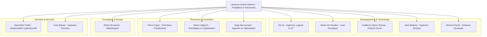

```mermaid
graph TD;
    A[Laurence Grand Clément - Fondatrice & Visionnaire]

    subgraph "Développement & Technologie"
    B[He Su - Ingénieur Logiciel & IoT]
    C[Adrien De Rosière - Lead Developer]
    D[Guillermo Simon Romay - Product Owner]
    E[Juba Belamiri - Ingénieur DevOps]
    AA[Ahmed Khchai - Software Developer]
    end

    subgraph "Recherche & Innovation"
    F[Pierre Cayet - Chercheur Postdoctoral]
    G[Raian Lefgoum - Scientifique en Optimisation]
    H[Hugo Marcaurelio - Apprenti en Optimisation]
    end

    subgraph "Conception & Design"
    I[Gloria Mvouama - Webdesigner]
    end

    subgraph "Données & Sécurité"
    J[Alexandre Puillet - Responsable Cybersécurité]
    K[Tuan Batuan - Ingénieur Données]
    end

    A --> B
    A --> C
    A --> D
    A --> E
    A --> AA
    A --> F
    A --> G
    A --> H
    A --> I
    A --> J
    A --> K

```